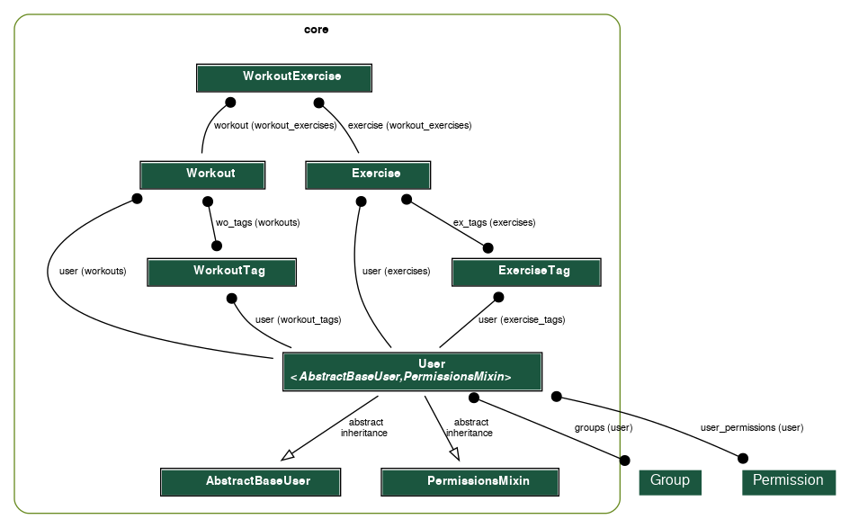
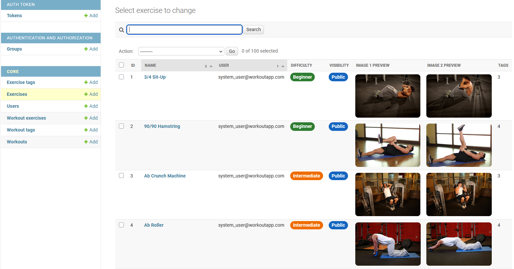
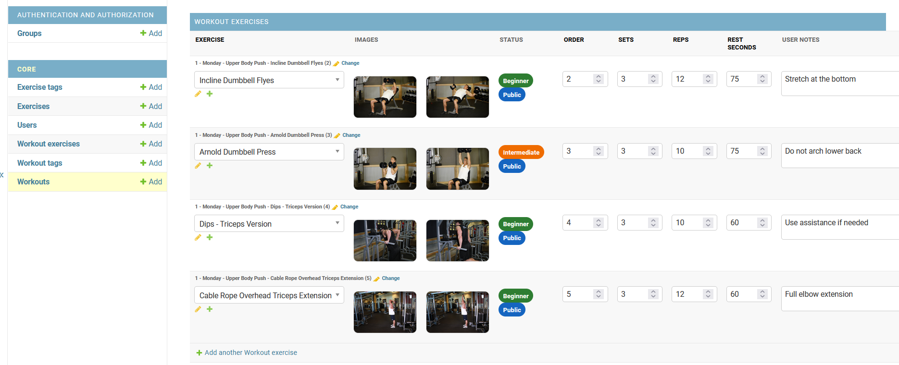

# Workout API Service

A production-style Django REST API for managing workouts, exercises, and user-scoped fitness data.

The system supports relational workout structures, reusable exercises, tagging, and filtering, with a focus on clean API design and scalable backend architecture.

The application is fully containerised with Docker and deployed on AWS EC2.

**Live API (Swagger Docs):** http://workoutapp.xmattc.com/api/docs/

---

## 🎯 Project Goal

This project explores how to design a backend system for structured workout planning, where:

- Users manage personalised workout routines
- Exercises are reusable across the system
- Workouts require ordered, configurable components

The focus is on backend architecture, data modelling, and API design.


---
## 🛠️ Tech Stack


- **Backend:** Python (Django, Django REST Framework)
- **Database:** PostgreSQL
- **Infrastructure:** Docker, Docker Compose, AWS EC2, Nginx (reverse proxy)
- **API Documentation:** OpenAPI / Swagger (drf-spectacular)

---

## 🔑 Key Features

- Token-based authentication (DRF)
- User-scoped data access (users only access their own resources)
- Structured workout composition via a relational `WorkoutExercise` model
- Public and private exercises
- Tagging system for workouts and exercises
- Filtering by tags and exercise relationships
- Image upload support for exercises
- Docker-based setup with PostgreSQL
- API schema and interactive documentation via OpenAPI (Swagger)

---


## 🧱 Engineering Practices

- Automated testing covering API and model behaviour  
- Dockerised development environment  
- Environment configuration via environment variables  
- Code quality checks using flake8  
- Modular Django app structure  
- Test-Driven Development (TDD) applied to core features  
  - [Example commit history](https://github.com/xMattC/workout-api-service/commits/feature/workout_api)

### Development Workflow

- Feature branches for isolated development  
- Pull requests for code review and integration  
- GitHub Actions for continuous integration (tests + linting)  
- Kanban-based task tracking  
  - [Project board](https://github.com/users/xMattC/projects/2)

---

## 📊 System Architecture

Client → API → Authentication → Application Layer → Database

High-level domain model showing workouts, exercises, and relationships:



See full system design and detailed ERD:
[Workout Architecture](./docs/workout-api-architecture.md)

---

## 💻 Custom Admin Interface

A custom back-office interface is implemented using Django Admin to manage relational workout data.

### Key Enhancements

- Inline editing of workout exercises
- Image previews for exercises
- Structured workout configuration (sets, reps, rest, notes)
- Clear organisation of relational data


### Exercise Management

Provides an overview of exercises, including difficulty, visibility, and image previews.




### Workout Builder

Inline editing enables construction of workouts with control over exercise order and configuration.



---

##  📈 Data Modelling

A key challenge in this project was modelling workouts composed of multiple exercises with additional metadata.

This is solved using an intermediate model:

`Workout → WorkoutExercise → Exercise`

This allows:

- Per-exercise configuration (sets, reps, rest, notes)
- Ordering of exercises within a workout
- Reusable exercise library across users

This structure enables flexible workout composition.

---

## 🔐 Authentication & Permissions

Authentication is handled using DRF `TokenAuthentication`.

Permissions are enforced using:

- `IsAuthenticated` for protected routes
- Querysets filtered by the authenticated user
- Ownership rules preventing access to other users’ data

---


## ⚠️ Validation & Error Handling

- Invalid credentials return HTTP 400
- Unauthenticated requests return HTTP 401
- Unauthorized access returns HTTP 403
- Input validation is enforced via DRF serializers

---


## ⚙️ Known Limitations

- Uses DRF token authentication; JWT/OAuth flows are not implemented
- Designed as a portfolio backend service rather than a production-hardened application
- CI covers basic automated checks only
- No rate limiting or advanced observability tooling
- Some workout fields are simplified rather than fully derived
- Demo environment may be reset or changed without notice

---

## 📦 Running Locally

### Prerequisites

Before running this project, ensure you have:

- Git (to clone the repository)
- Docker & Docker Compose (to run the application)

> If you're using Windows or macOS, install Docker Desktop which includes Docker Compose.

### 1. Clone Repository

```bash
git clone https://github.com/xMattC/workout-api-service.git
cd workout-api-service
```

### 2. Run Migrations

```bash
docker-compose run --rm app sh -c "python manage.py migrate"
```

### 3. Seed Data

```bash
docker-compose run --rm app sh -c "python manage.py seed_exercise_data"
docker-compose run --rm app sh -c "python manage.py seed_user_workout_data"
```

### 4. Create Superuser

Run the following command to create a superuser (non-interactive):

```bash
docker-compose run --rm \
  -e DJANGO_SUPERUSER_EMAIL=admin@example.com \
  -e DJANGO_SUPERUSER_PASSWORD=change-me \
  app python manage.py createsuperuser --noinput
```

Example local admin:
> Email: admin@example.com<br>
> Password: change-me<br>
> (Local development only)

### 5. Start Server

```bash
docker-compose up
```
---
### Accessing Admin

**Admin URL:**
http://localhost:8000/admin/

Login using the local admin credentials above.

### API Documentation

**Swagger docs URL:**
http://localhost:8000/api/docs/

### Testing & Linting

```bash
docker-compose run --rm app sh -c "python manage.py test && flake8"
```

---

## Notes for Reviewers

- Backend-focused project (no frontend)
- Admin interface is customised but not publicly exposed (run locally to verify)
- Demo data is reproducible locally via management commands
- Designed as a portfolio backend system
