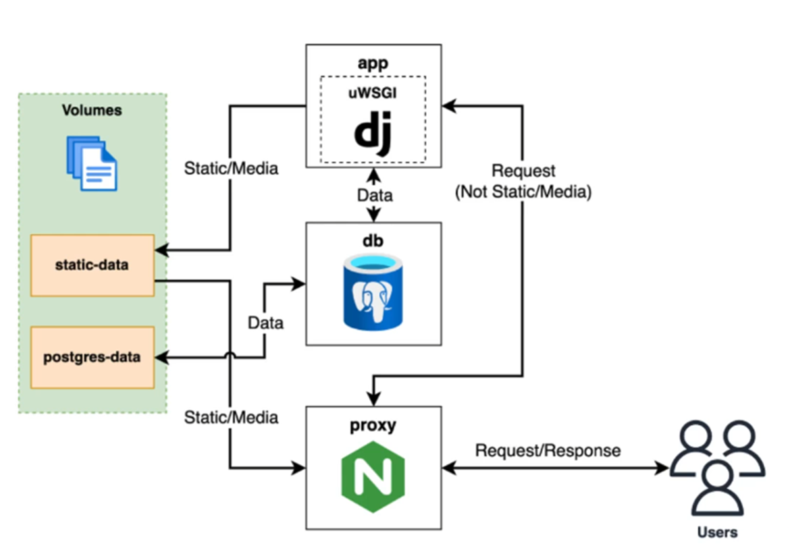

# Deployment

This project includes separate Docker Compose configurations for development and production-style deployment.

---

## Architecture Overview

---

## Production Services

The production deployment uses three services:

### App
- Runs the Django application
- Connects to PostgreSQL
- Writes collected static files to a shared volume

### Database
- PostgreSQL database
- Data persisted using a named Docker volume

### Proxy
- Nginx reverse proxy
- Accepts incoming HTTP traffic
- Serves static files from a shared volume
- Forwards application requests to the Django app

---

## Persistent Volumes

The production setup uses named volumes for persistence:

- `postgres-data` → PostgreSQL data
- `static_data` → static files shared between app and proxy

This ensures important data survives container restarts.

---

## Environment Configuration

The production setup is driven by environment variables, including:

- `DB_NAME`
- `DB_USER`
- `DB_PASS`
- `DJANGO_SECRET_KEY`
- `DJANGO_ALLOWED_HOSTS`

---

## Development vs Production

### Development
The local development setup:
- uses Django’s development server
- bind-mounts the application source code
- runs migrations automatically on startup
- uses separate development volumes

### Production
The deployment setup:
- separates the proxy and app services
- persists database and static data in named volumes
- exposes HTTP traffic through the proxy container

---

## Request Flow

1. A client sends a request to the proxy
2. The proxy forwards application requests to the Django app
3. The Django app reads/writes application data in PostgreSQL
4. Static files are served through the shared static volume

---

## Notes

- Development and deployment use different Compose files
- The deployment architecture mirrors a typical Django + PostgreSQL + Nginx setup
- Static assets are separated from the application container through shared storage
