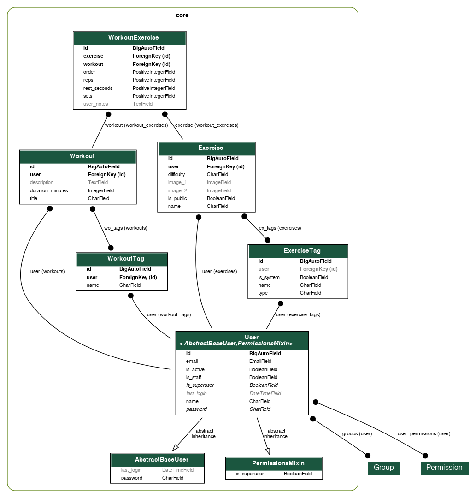

# Workout API Architecture

This document describes the core architecture of the workout system, focusing on data modelling, relationships, and design decisions.

---

## Domain Overview

The system is designed to support structured workout planning where:

* Users create and manage personalised workouts
* Exercises are reusable across the system
* Workouts are composed of ordered, configurable exercise entries

The architecture is built around a relational model that supports flexibility, reuse, and strict user ownership.

---

## Domain Model (ERD)

---

## Core Entities

### User

Custom user model based on Django’s `AbstractBaseUser` and `PermissionsMixin`.

Responsible for:

* Authentication (email-based login)
* Ownership of all user-specific data

---

### Exercise

Represents a reusable exercise definition.

**Key fields:**

* `name`
* `difficulty`
* `image_1`, `image_2`
* `is_public`
* `user` (owner)

**Behaviour:**

* Public exercises are accessible to all users
* Private exercises are scoped to the owning user

---

### Workout

Represents a collection of exercises.

**Key fields:**

* `title`
* `description`
* `duration_minutes`
* `user` (owner)

**Behaviour:**

* Fully user-scoped
* Acts as a container for ordered exercise entries

---

### WorkoutExercise (Intermediate Model)

This is the **core of the system design**.

Links `Workout` and `Exercise` while storing additional metadata.

**Key fields:**

* `workout` (FK)
* `exercise` (FK)
* `order`
* `sets`
* `reps`
* `rest_seconds`
* `user_notes`

---

## Relationship Design

### Why an Intermediate Model?

Instead of a simple many-to-many relationship, an explicit model (`WorkoutExercise`) is used.

This enables:

* **Ordering** of exercises within a workout
* **Per-exercise configuration** (sets, reps, rest)
* **Additional metadata** (notes)
* **Future extensibility**

---

### Relationship Structure

* A `Workout` has many `WorkoutExercise` entries
* An `Exercise` can belong to many workouts via `WorkoutExercise`
* Each `WorkoutExercise` defines one instance of an exercise within a workout

---

## Tagging System

The system includes tagging for both workouts and exercises.

### ExerciseTag

* Associated with exercises
* Supports categorisation (e.g. type, muscle group)
* Can be system-defined or user-created

### WorkoutTag

* Associated with workouts
* Allows grouping or filtering of routines

---

## Ownership & Data Isolation

The system enforces strict user-level data ownership.

### Rules:

* Users can only access their own workouts
* Users can only modify their own data
* Exercises are either:

  * Public (shared across users)
  * Private (user-specific)

### Implementation:

* Querysets filtered by `request.user`
* DRF permission classes (`IsAuthenticated`)
* Ownership checks enforced at the view level

---

## Data Flow

### Creating a Workout

1. User creates a workout
2. Workout is linked to the authenticated user

---

### Adding Exercises to a Workout

1. User selects an exercise
2. A `WorkoutExercise` instance is created
3. Configuration (sets, reps, rest, notes) is stored
4. Order is assigned

---

### Retrieving Workouts

* Workouts are returned with nested `WorkoutExercise` data
* Each entry includes:

  * Exercise details
  * Configuration metadata

---

## Derived Logic

### Workout Duration

* Stored as `duration_minutes` on the `Workout` model
* Can be derived from exercise configurations (future enhancement)

---

## API Design Considerations

The API is designed to:

* Reflect the underlying relational structure
* Support nested representations for usability
* Enforce ownership at every level

### Key Patterns:

* Nested serializers for workouts and exercises
* Token-based authentication
* Consistent endpoint structure

---

## Design Decisions

### 1. Intermediate Model over Many-to-Many

Chosen to support ordering and metadata per exercise.

---

### 2. Token Authentication over JWT

Simpler implementation suitable for this use case.

---

### 3. Public vs Private Exercises

Allows reuse of common exercises while maintaining user-specific data.

---

### 4. Django Admin as Internal Tooling

Used to manage complex relational data efficiently without building a custom frontend.

---

## Summary

This architecture enables:

* Flexible workout composition
* Reusable exercise definitions
* Strong data ownership guarantees
* Clear separation of concerns

The use of an intermediate model (`WorkoutExercise`) is central to enabling rich, structured workout data while maintaining scalability.
